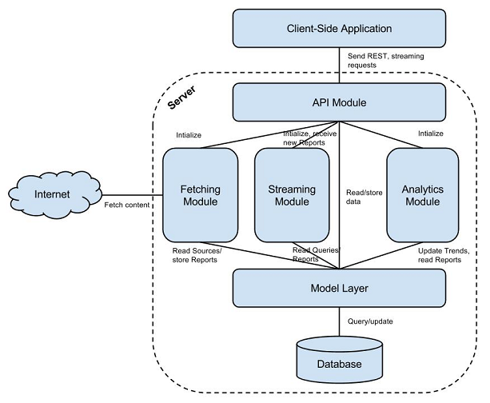

# Introduction

Aggie is a real-time, user-generated content aggregation and analysis platform premised on the core principles of:

**Technological neutrality**: Support content from popular social media platforms along with media originating from purpose-built systems (namely those specific to election monitoring, crises, or conflict response).

**Computer enabled expert analysis**: Automated computer analysis augments and enhances expert human real-time reasoning and decision making.

**Real-time response**: Moving from online report aggregation to analysis, escalation and response within one hour.

**Big data**: Supporting up to 1,000 incoming reports per second.

**Open source principles**: Aggie is fully open source and welcomes contributions.

## Achitectural Design

Achitecturally, Aggie has two modules; the backend server that crawls the internet to aggregate user generated content, and a front end client API that runs on a browser.

## Acknowledgements

Aggie has reached thus far from the generous contributions of many developers and collaborators. To date, sixteen developers have contributed code to Aggie's Project ([**list here**](collaborations.html)). We thank everyone involved in the open source community of Aggie.
