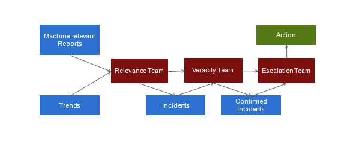

# Establishing the SMTC

## What is the SMTC?

The **Social Media Tracking Centre** (SMTC) serves as a physical space in which volunteers gather and work around the clock to monitor social media traffic via Aggie. SMTC members monitor and respond in real-time to reports from digital platforms such as Twitter, Facebook, ELMO, Ushahidi, and RSS feeds from blogs or traditional media sites. Key teams of the SMTC include the *tracking team*, the *veracity team*, the *escalation team*, the *leadership team* and the *embedded stakeholder team*. Team members need training on Aggie prior to the event being monitored. The SMTC Leadership Team is essential for coordinating activities in the centre. The diagram below indicates the operational flow of the various teams in the SMTC. 

## Key Term Definitions

### Tracking Team

The *tracking team* is responsible for reading through the real-time streams of social media reports aggregated by Aggie either in batches or by navigating through pages. Their workflow involves going through each report and creating an incident from actionable reports.

### Veracity Team

After the tracking team creates an incident, the *veracity team* takes over to investigate and verify the truthfulness of the incident created by trackers using some of the below strategies:
1.  Using social media platforms to communicate with the author of the report  (i.e. Tweeting at the author).
2.  Using triangulation to build evidence from other reports and sources.
3.  Contacting formal monitors in the field.
4.  Contacting embedded SMTC representatives who can ask relevant stakeholders to confirm or deny veracity.

### Escalation Team

Once the veracity team has confidently verified an incident to be true, the *escalation team* reports the incident to the SMTC embed assigned to  relevant stakeholders, providing all relevant information gathered.  The escalation team will move swiftly to communicate verified incidents so that relevant stakeholders may respond in real-time.

### Stakeholder/Embedded Team

Embeds are key persons placed in civil organizations or government institutions invested in the coordination and supervision of the event being monitored. Embeds communicate verified incidents to these organizations, called stakeholders, which get more details about and respond to these incidents. Ideally, embeds are known and trusted by stakeholders to ensure information reported from the SMTC is valued.

## Public Event Monitoring Checklist

To be set for a monitoring event, cross check the status of the items and activities in the table below a day to deployment of the monitoring.

<table border="3" width="100%" cellpadding="4" cellspacing="4">

  <tr>
    <th>No</th>
    <th>Item</th>
    <th>Activities</th>

  </tr>
  <tr>
    <td style="text-align:center">1</td>
   <td>Physical Space</td>
    <td>SMTC centre, furniture etc.</td>
  </tr>

  <tr>
    <td style="text-align:center">2</td>
    <td>Personnel</td>
    <td>Set up SMTC and teams. Build relationships with relevant stakeholders and communicate SMTC value added on the day of monitoring the event</td>
  </tr>

  <tr>
    <td style="text-align:center">3</td>
    <td>Source Aggregation</td>
    <td>Create query keywords and source handles to fellow</td>
  </tr>

  <tr>
    <td style="text-align:center">4</td>
    <td>Network/Systems</td>
    <td>Internet acess and computers, dedicated power supply</td>
  </tr>

  <tr>
    <td style="text-align:center">5</td>
    <td>Set up Aggie Instance</td>
    <td>Deploy server, add source feeds to the Aggie instance</td>
  </tr>

  <tr>
    <td style="text-align:center">6</td>
    <td>Training</td>
    <td>Train SMTC Teams on Aggie, allocate login credentials</td>
  </tr>

  <tr>
    <td style="text-align:center">7</td>
    <td>Run a full Demo Test</td>
    <td>Run a demo process a day earlier with entire team</td>
  </tr>

</table>
