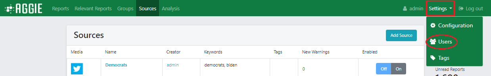
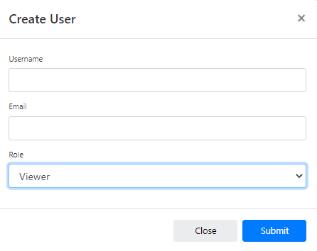

# User Management

There are three main user categories in Aggie with varying Privileges: *Viewer, Monitor* and *Admin*. The table below indicates the privileges associated with each user category.

## User privileges

<table border="3" width="100%" cellpadding="4" cellspacing="4">

  <tr>
    <th>Action</th>
    <th>Admin</th>
    <th>Monitor</th>
    <th>Viewer</th>
  </tr>

  <tr>
    <td>View: Sources, Reports, Incidents and Trends</td>
    <td style="text-align:center">X</td>
    <td style="text-align:center">X</td>
    <td style="text-align:center">X</td>
  </tr>

  <tr>
    <td>Create: Sources, Incidents and Trends</td>
    <td style="text-align:center">X</td>
    <td style="text-align:center">X</td>
    <td></td>
  </tr>

  <tr>
    <td>Edit: Sources, Incidents, Trends</td>
    <td style="text-align:center">X</td>
    <td style="text-align:center">X</td>
    <td></td>
  </tr>

  <tr>
    <td>Delete: Sources, Incidents and Trends</td>
    <td style="text-align:center">X</td>
    <td style="text-align:center">X</td>
    <td></td>
  </tr>

  <tr>
    <td>Add Reports to Incidents</td>
    <td style="text-align:center">X</td>
    <td style="text-align:center">X</td>
    <td></td>
  </tr>

  <tr>
    <td>Change Reports Status</td>
    <td style="text-align:center">X</td>
    <td style="text-align:center">X</td>
    <td></td>
  </tr>

  <tr>
    <td>Checkout Batch</td>
    <td style="text-align:center">X</td>
    <td style="text-align:center">X</td>
    <td></td>
  </tr>

  <tr>
    <td>View and Edit Settings</td>
    <td style="text-align:center">X</td>
    <td></td>
    <td></td>
  </tr>

  <tr>
    <td>Clear all Reports or Incidents</td>
    <td style="text-align:center">X</td>
    <td></td>
    <td></td>
  </tr>
</table>  

## Creating a New User

Only an *Admin* user can create a *new user*. To create a *new user*, follow the steps below.

1.  Click the **Settings** tab.

    

2.  From the drop down list click **Users**.

    

3.  Click on blue **Create User** button on the left of the page.

    

4.  Type in the *Username* and the *user’s email* address in the first two fields.
5.  Select a *Role* (*Viewer, Monitor or Admin*) for the user. A user’s role determines which actions they have permission to access, as per the table in the [User Privileges](#user-privileges) section.
6.  Click **Submit** to create a *new user*. The user will receive an email with a link to Aggie and the user can change their password after logging in.
