# Using Aggie

## Sources

### What is a Source?

Sources are the social media platforms such as *Twitter, Facebook, Ushahidi, and RSS feeds* that Aggie crawls through to aggregate reports relevant to the event being monitored.

Sources can also be services that send reports directly to Aggie. Currently, we have implemented support for WhatsApp and [SMSGH](https://hubtel.com/messaging/), a service that forwards SMS text messages sent to [short codes](https://en.wikipedia.org/wiki/Short_code).

### Adding Sources to Aggie

1.  Click on **Sources** on the Header Menu of Aggie's main page.

    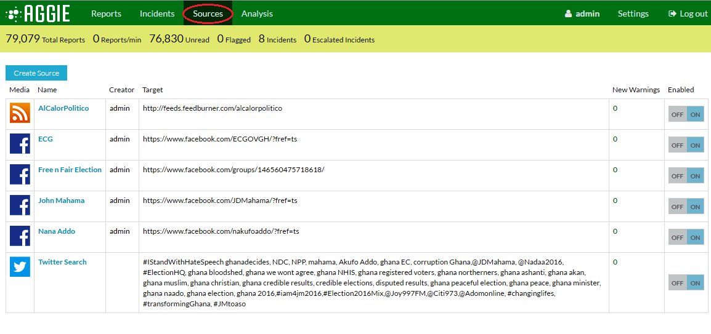

2.  Click on the blue **Create Source** button on the left.
3.  Choose the *Source Media*.

    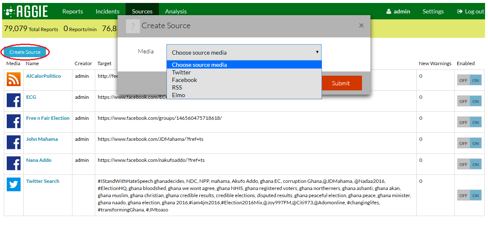

4.  Enter a *Name* for the source.
5.  Copy and Paste the *URL* of the source page and click **Submit**.

    

## Reports Page Activities

### What is a Report?

A report is any post collected from a [source](#what-is-a-source). Examples include *tweets, Facebook posts and blog posts*.

### The Reports Page

From your Aggie header bar, click the **Reports** Tab. This will show you the reports page as indicated below.

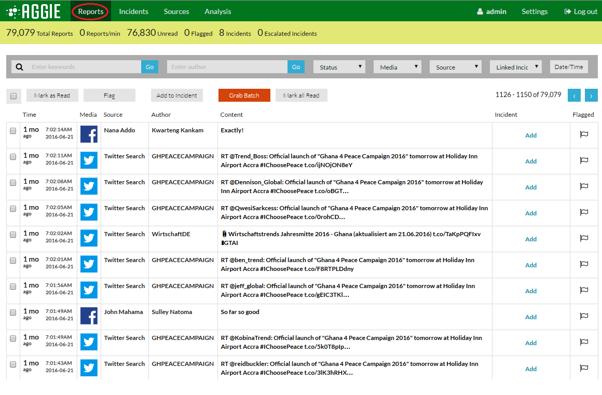

### Actions on the Reports Page

There are several actions you can take on the reports page of Aggie. You can [Read reports](#reading-reports), [Flag reports](#flagging-reports), [Create Incidents](#creating-incidents),[Filter reports](#filtering-reports)  or add a report to an [Incident](#what-is-an-incident).  Besides the *filter bar* and the *action* and *navigation buttons*, there are eight columns on the Reports Page of Aggie.

### Sections of the Reports Page

  -   **The Checkbox column**:
This is used to select one or more reports that some actions can be applied to.
  -   **The Time column**:
This indicates the time the report was published on the source feed that Aggie collected the report from.
  -   **The Media column**:
This indicates the platform where the report was published.  
  -   **The Source column**:
This column indicates the name of the source, as set in the Sources tab In the case of Twitter, they all originate from Twitter search but, for example, each Facebook group or page is a separate source. Advisably, the source name should be set the same name as the social media account name.
  -   **The Author column**:
This indicates the social media account of the person who authored the report.
  -   **The Content column**:
This column shows the exact content of the report published by the author.
  -   **The Incident column**:
This column is used to add a report to an existing incident or create a new incident.
  -   **The Flagged column**:
This column is used to note/identify reports for reference.

### Navigating within the Reports page.

In order to navigate to and from pages, the blue navigation arrows below the filter bar are used.  

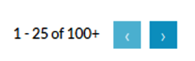

### Reading Reports

There are two ways to read reports in Aggie. One way is to grab a batch using the *“Grab Batch”* button. The other is to go through reports on the reports page, navigating from one page to another using the *navigation buttons* on the reports page. Grabbing a batch is a faster and a more efficient way of reading reports in Aggie.

#### Reading using the "Grab Batch" button

The “*Grab Batch*” automatically pulls a set of ten unread reports that are displayed in batch mode. The batch mode is noted by the indication of a *blue bar* on the reports page. Users can take certain actions on these ten reports – such as [“flagging”](#flagging-reports) or [“adding reports to incidents”](#creating-incidents).  Upon completely taking desired action on the collected reports, trackers can grab another batch by clicking the “**Mark All Read & Grab Another**” button.

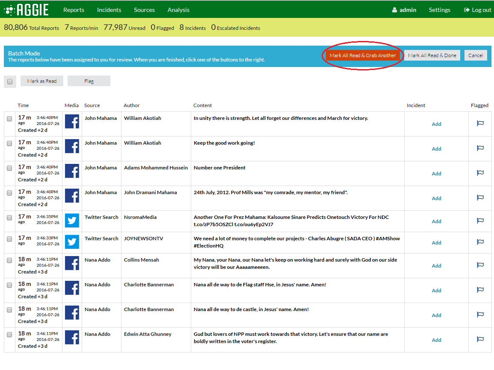

#### Marking Reports as Read

A report can be manually marked as read. More than one reports can be marked as read by checking their respective checkboxes or with the “*Mark all Read*” button. When a tracker grabs a new batch, it is recommended that the tracker selects either *“Mark All Read & Grab Another”* or *“Mark All Read & Done”*. If the batch was accidentally grabbed, the tracker should click the *"Cancel"* button.

### Flagging Reports

A *flag* is a way of marking a report for future reference. Trackers might come across certain reports they wish to revisit and easily find. In situations like that, trackers can flag the report and then *filter* it latter by using *flagged reports* filter.

#### To Flag a Report

1.  Select the report(s) to be flagged using the *checkboxes* on each report row.
2.  Click the **Flag** tab beneath the filter bar if multiple reports are selected.
3.  You can flag a single message by clicking the **little flag** in the last column of the report’s row.

For example to flag the sixth report, you click on the *flag* in the last column of the first row. You notice that a report is flagged by the *light pink highlight* and the *black flag* on the report as indicated below.

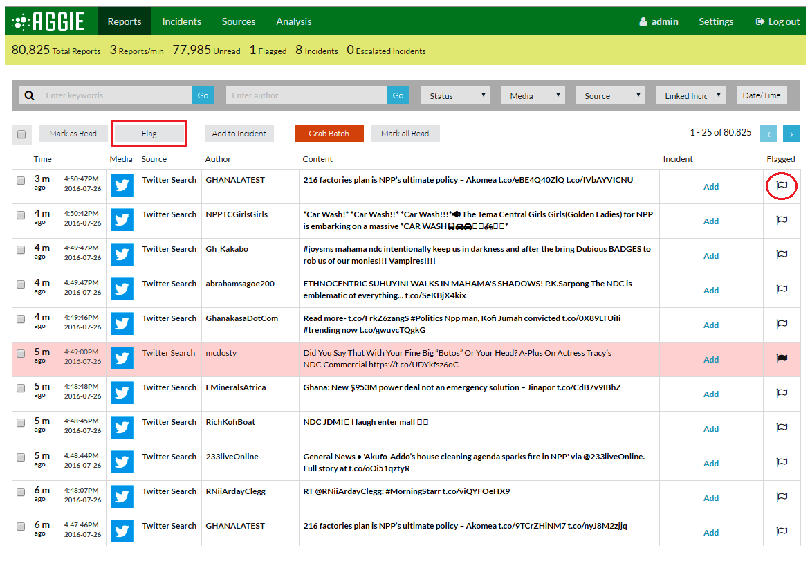

### Creating Incidents

#### Adding a report to an existing Incident

When trackers come across reports that, if verified, require action, they create an incident from that report. Or, if the report is associated with an already existing incident, the tracker may add the report to the existing incident.

#### Creating a New Incident

1.  Select the report(s) you are creating the *Incident* for by checking its/their *checkbox(es)* on the first column to the left fo the reports page.

    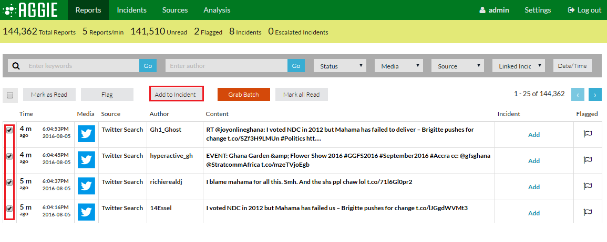

2.  Click the **Add to Incident** button beneath the filter bar.

    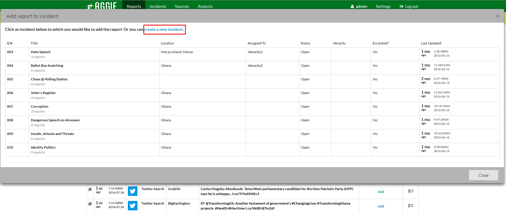

3.  Select the related category of an *existing incident* to add the report to that incident or…
**If it's a new Incident**;
4. Click on the *blue* **Create a new Incident** link to create the new incident.

    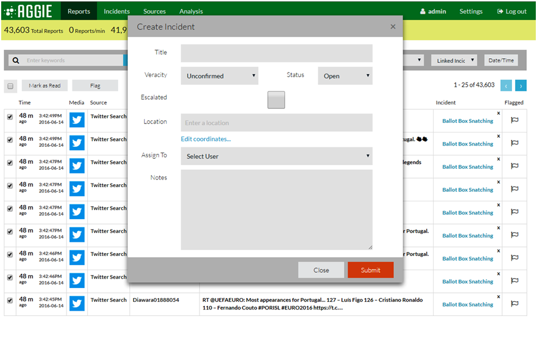

5.  Type in the *Title* of the incident (*e.g. Polling station not open, Voter intimidation etc*), the *Location* of the incident and a brief *note* describing the incident. Leave out the *veracity* and *assignment* fields for the veracity team and click **submit** to create a new incident. The verification and escalation team will be using the *note* field to keep track of the verification and escalation steps taken. 

6.  The *Public* and *Public Description* fields are used by the escalation team to add the incident to the list of public incidents. The *Public Description* will appear attached to the incident, for example, in the [Public Incident Map](#public_incident_map).

### Filtering Reports

#### The Filter Bar

With the *filter bar*, trackers can narrow down their search for specific types of reports. The screenshot below shows the filter bar and a number of filters that can be used.

    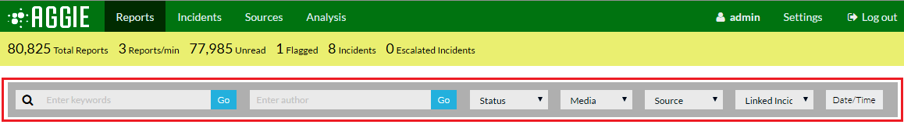  

#### Filtering by Date/Time

1.  Click on **Date/Time** button on the right end of the filter bar.
2.  Select a Date/Time range by specifying the *From* and *To* fields.
3.  Click **Submit** to filter and display reports aggregated within that date and time range.

    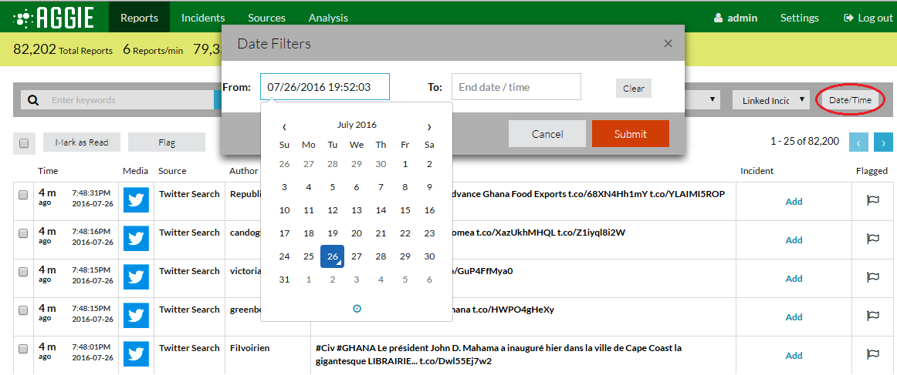

#### Filtering by Incident

1.  Click on the **Linked Incident** tab and select an incident to view all related reports tagged to that incident.
2.  In this example, selecting the incident *Hate Speech* shows the three reports which have been linked to that incident.

    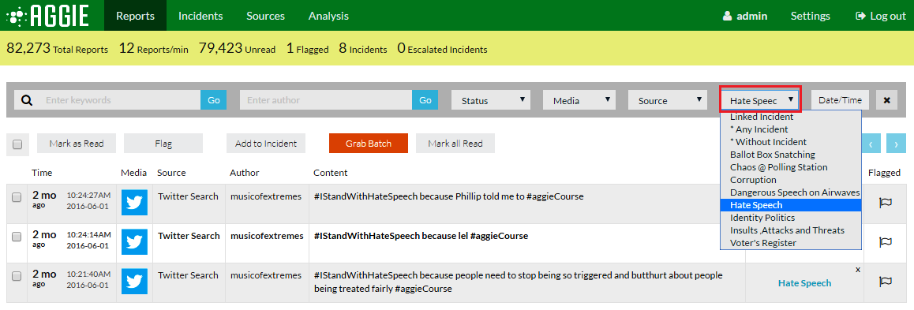

#### Filtering by Source

1.  Click the **Source** menu from the header bar.
2.  Select the *Source type (e.g. Twitter Search)* to filter and display only reports from that source.

    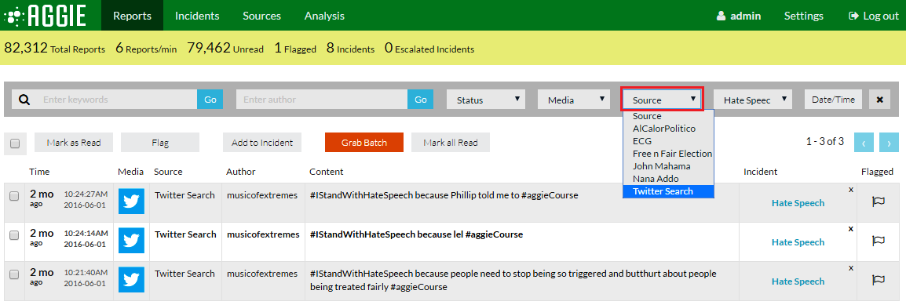

#### Filtering by Media Type

1.  From the header bar, click the **Media** menu.
2.  Select the *Media type* (e.g. Twitter, RSS) to filter and display reports from sources of that media type.

    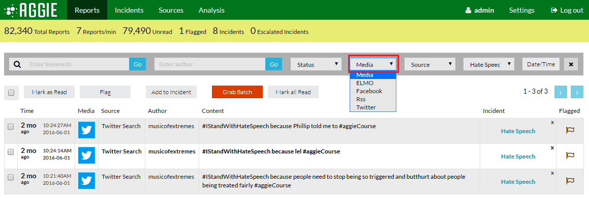

#### Filtering by Status

1.  From the Header Bar, click the **Status** menu.
2.  Select the report *Status (e.g. Flagged, Unread, Read)* to display the reports of that status.

    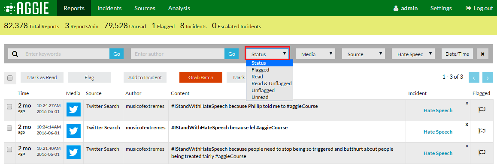

#### Filtering by Author

1.  Type in all or part of the name of an *Author, e.g. the user name of a Facebook account or a Twitter handle,* in the **Enter author** space on the filter bar.
2.  Click **Go** to show only reports by authors with matching names.
For example, entering the author *JoyNews*, and clicking **Go** displays all the reports published by JoyNews.

    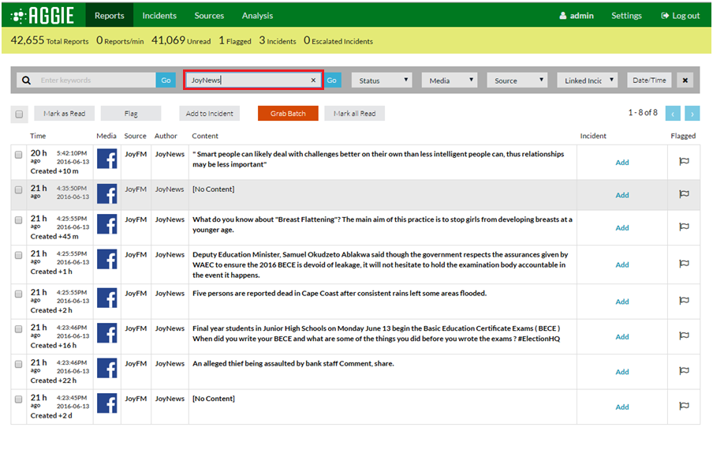

#### Filtering by Keywords

1.  Type in a *query keyword*, term or set of terms separated by commas, quotations or operators in the **Enter keywords** space on the Filter bar.
2.  Click **Go** or the return key to display all reports that include the keyword or set of terms.
For example, by searching the keywords, *Ghana*, *ECG* and *Free n Fair Election*, there is a display of all reports containing one or more of the keywords.

    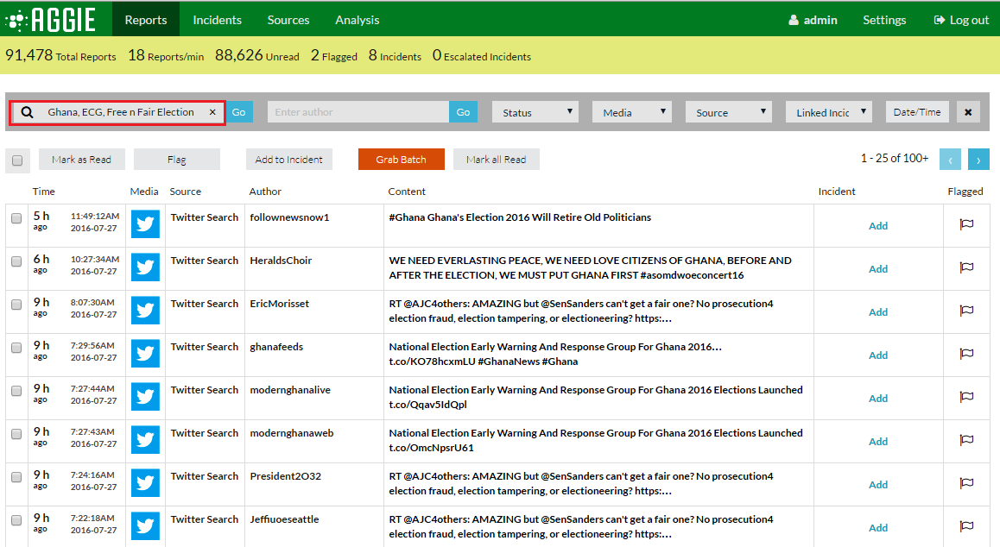

## Incidents Page Activities

### What is an Incident?

Incidents are groups of one or more [reports](#what-is-a-report) that, once verified, require an action. As Aggie aggregates reports from different sources, tracking team members in the SMTC collect reports into incidents.

### The Incidents Page

From your Aggie header page, click the **Incidents** Tab. This will show you the incidents page as indicated below.

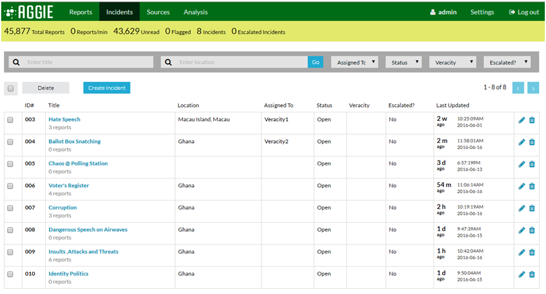

### Sections of the Incidents Page

  -   **The Checkbox column:**
This is used to select one or more incidents that some actions can be applied to.
  -   **The ID# column:**
This column indicates the unique identification number generated for each incident created. This example starts with 003 because incident 001 and 002 have been deleted.
  -   **The Title column:**
This column shows the name given to the incident and the number of reports associated with the particular incident.
  -   **The Location column:**
This column shows the place where the incident occurred.
  -   **The Assigned to column:**
This column indicates the veracity team member who has been assigned to verify the incident for confirmation (and then escalation) or closure.
  -   **The Status column:**
This column shows whether the incident has been escalated or confirmed false, and closed, or is still open and thus needs to be verified or escalated.
  -   **The Veracity column:**
This shows the verification status of the incident. Whether the investigations confirmed the incident to be true or false.
  -   **The Escalated column:**
This column show whether a confirmed incident been reported to stakeholders and embeds for management and resolution.
  -   **The Last Updated column:**
This column tracks and indicates the time of the last activity such as editing or updating on the incident.
  -   **The Edit/Delete Column:**
This column contains two tools for editing or deleting an incident; to edit the incident, click the blue **Pencil Icon** or to **delete** the incident click the blue **small bin**.

### Creating an Incident

Normally, *incidents* are created by Trackers. However, should the need arise, verifiers can create *incidents* from the incidents page. To do this, refer to [Creating a New Incident](#creating-a-new-incident) section.
1.  Click the **Incidents** tab from the header bar.

    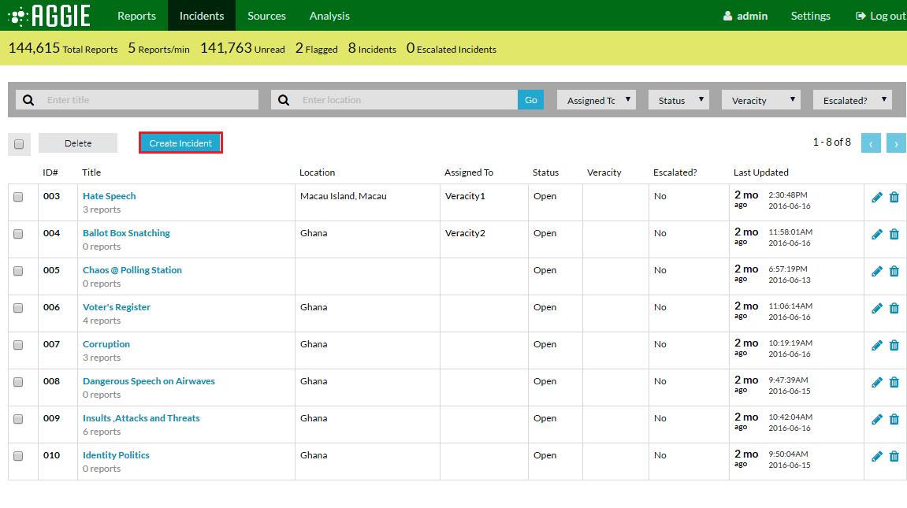

2.  From the incidents page, click the  blue colored **Create Incident** tab.

    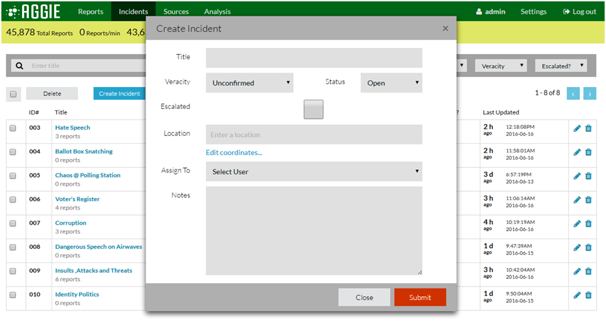

3.  Type in the *Title* of the incident (*e.g. Polling Station not open, Voter Intimidation etc*), the *Location* of the Incident and a brief note describing the incident. Set the veracity and status fields as applicable.

### Editing an Incident

Verifiers can always update the status of incidents by editing them. It is recommended that you keep a log of the actions taken while confirming or denying veracity in the notes section of an Incident. To do this:
1.  From the incidents page, click the **blue edit pencil** at the end of the incident row (last column).

    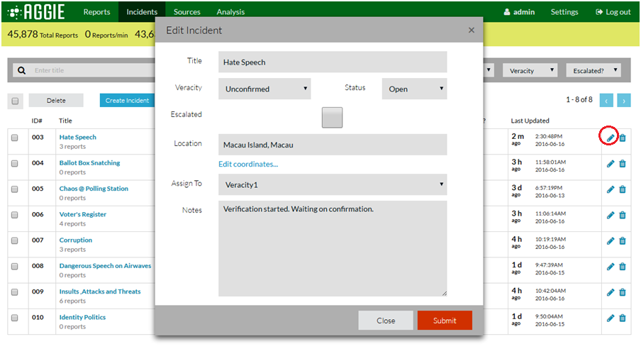

2.  Update the incident by editing appropriate sections. For example, you can edit the *veracity* and *status* of the incident, add any helpful *notes* or *escalate* the incident.

### Deleting an Incident

If a veracity team member notices a redundancy in incidents, they may *delete* an incident from the Incidents page. To do this:
1.  Select the *incident(s)* you wish to delete by checking its/their respective *checkbox(es)*.
2.  Click the **Delete** button below the filter bar to the left.

    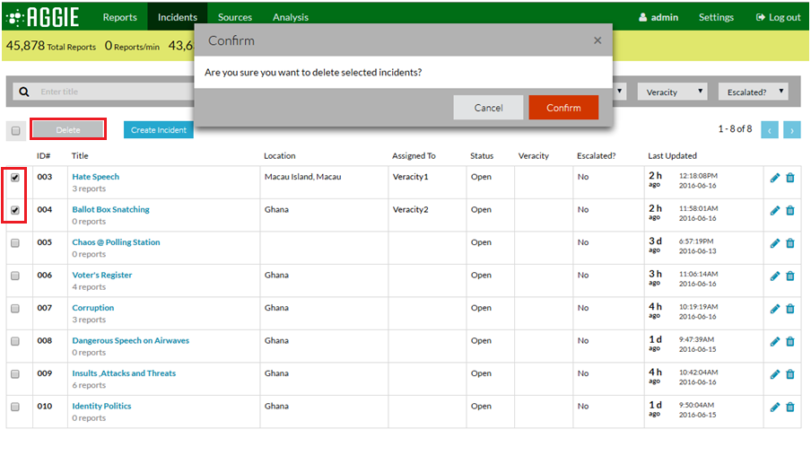

3.  Click **Confirm** to delete the selected incident(s).

*Alternatively, you can delete an incident by clicking the little bin on the last column of the incident row.*

### The Incident Filter Bar

With *filters*, verifiers can narrow down their search. In some cases, there might arise the need to search for specific types of incidents. Filters are the best way to achieve this. Below are a number of filters that can be used.

#### Filtering by Assigned User

1.  From the incidents page, click the **Assigned To** menu on the filter bar.
2.  Select an *assignee (username)* to display only the incidents assigned to that verifier.

    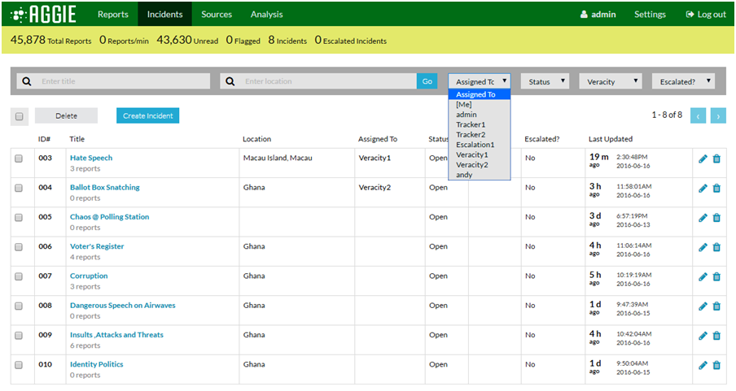

#### Filtering by Status

1.  Click the **Status** menu on the filter bar.
2.  Select *Open* or *Closed* to view incidents in these categories.

    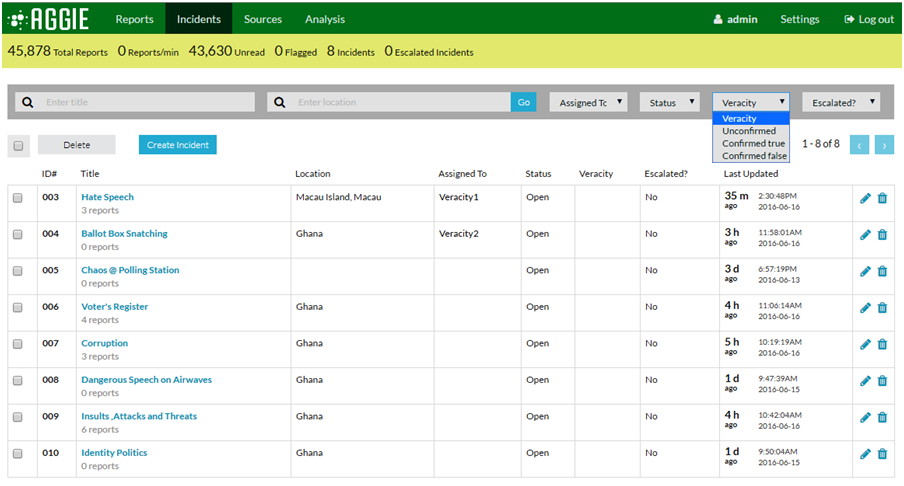

#### Filtering by Veracity

1.  Click the **Veracity** menu on the filter bar.
2.  Select the veracity status (*unconfirmed, confirmed, confirmed true* etc.) to display all incidents associated with that veracity status.

    

#### Filtering by Escalation

1.  Click the **Escalated?** menu on the filter bar
2.  Select the *escalation status (Escalated or Unescalated)* to display incidents accordingly.

    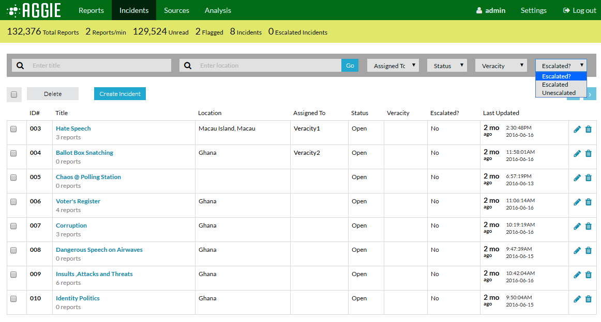

#### Filtering by Title Search

1.  Type in an *incident title* in the **Enter title** space on the filter bar.
2.  Click **Go** or hit the return key to *filter and display only incidents* that include the entered title.   
For example by searching the incident title *“attacks”,* there is a display of all incidents containing this keyword.

    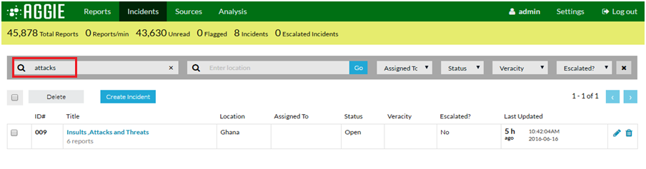

#### Filtering by Location Search

1.  Type in the name of a *location (town, polling station etc.)* in the **Enter Location** text box on the filter bar.
2.  Click **Go** to display all incidents associated with that location.
  For example, typing in *Ghana* in the *Location Text box*, display all incidents whose location was entered as *“Ghana”*.

    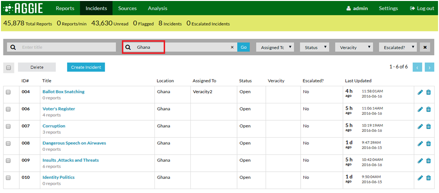

## Trend Analysis

Trend analysis give snappy and easy graphical visualizations of the occurrences of incidents using keywords, social media type, the Twitter handles, or Facebook groups/pages to build trends.

### What is an Analytic Trend?

An analytic trend is a graphical visualizations of incidents as bar charts or stacked lines.

### Creating a Trend

To create a trend visualization:

1.  Click the **Analysis tab** from the header bar.

    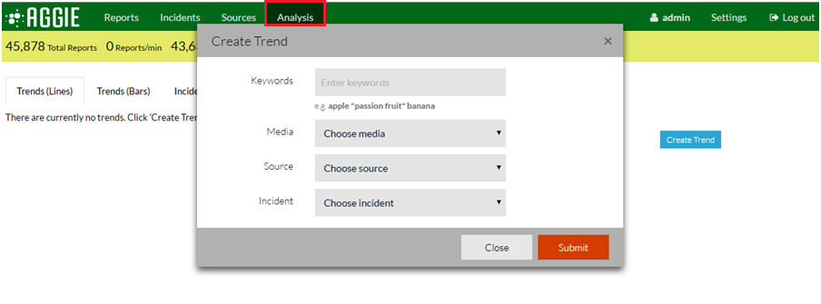

2.  Click the blue **Create Trend** button.

    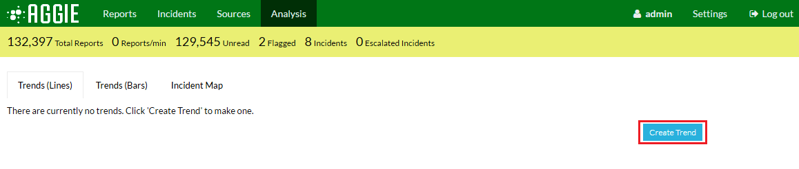

3.  Enter the *keyword(s)* you want to create the trend for. For example *NDC, NPP*.

    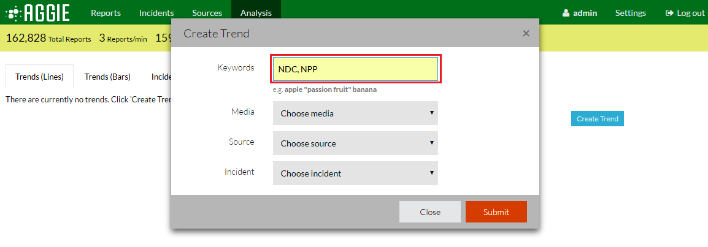

4.  Choose a *Social Media Source* for the trend e.g. Twitter, RSS or Facebook.

    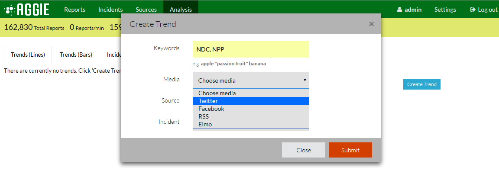

5.  Choose the *Source* of the trend i.e. the *social media account* been followed.

    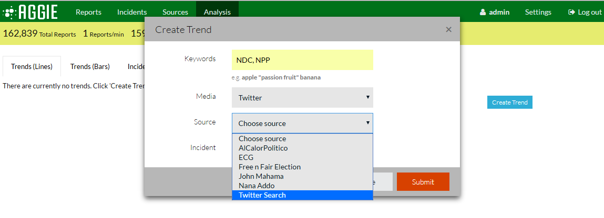

6. Choose the *Incident* for the trend e.g. *233liveOnline Reports*

    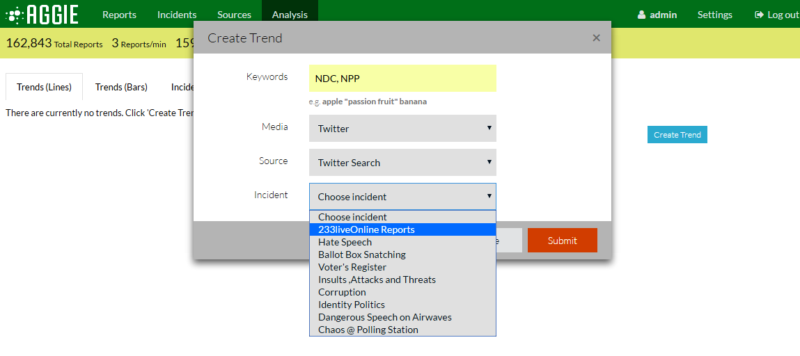

7. Submit and view the analytics by *Trend (Lines or Bars)* and *Incident Maps*.

    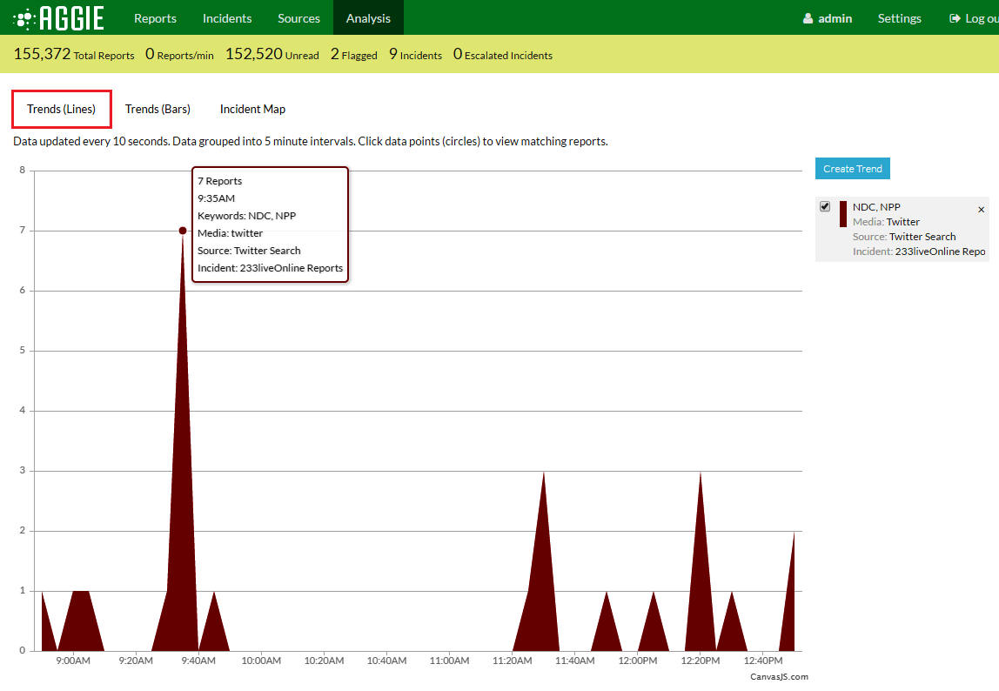
