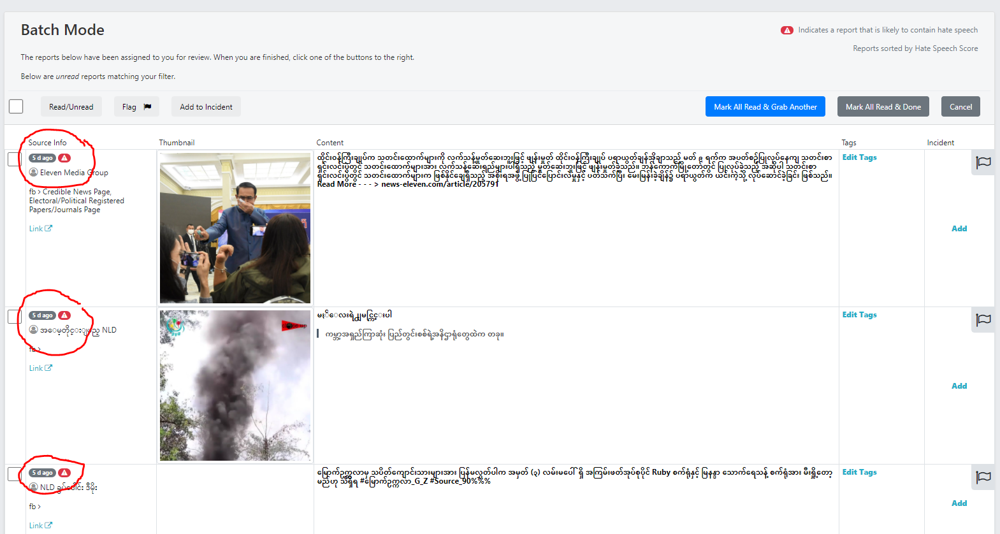
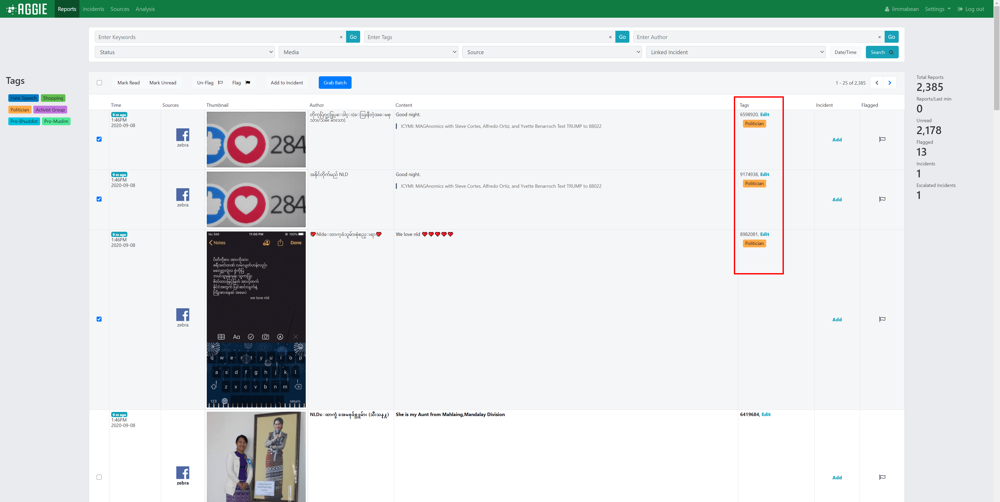
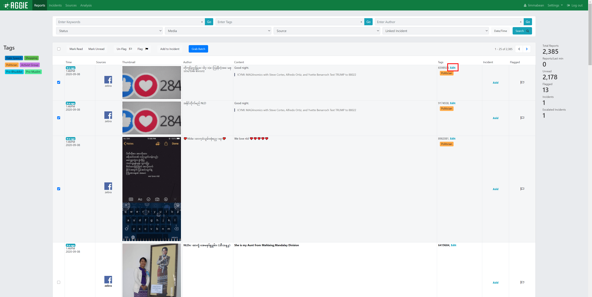
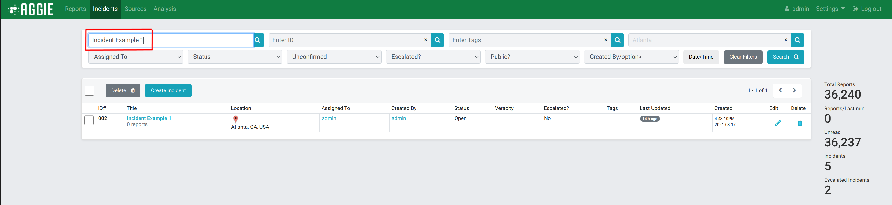

# Using Aggie

## Sources

### What is a Source?

Sources are the social media platforms such as *Twitter, Facebook, Ushahidi, and RSS feeds* that Aggie crawls through to aggregate reports relevant to the event being monitored.

Sources can also be services that send reports directly to Aggie. Currently, we have implemented support for WhatsApp and [SMSGH](https://hubtel.com/messaging/), a service that forwards SMS text messages sent to [short codes](https://en.wikipedia.org/wiki/Short_code).

### Adding Sources to Aggie

1.  Click on **Sources** on the Header Menu of Aggie's main page.

    

2.  Click on the blue **Create Source** button on the left.
3.  Choose the *Source Media*.

    

4.  Enter a *Name* for the source.
5.  Copy and Paste the *URL* of the source page and click **Submit**.

    

### Warnings

As the application pulls in data, the app may encounter warnings. These warnings help determine whether or not a feed is pulling in data correctly.

1. Go to `Sources`.
1. In the `Name` column, click the appropriate source.
1. Under `Recent Events`, you can see recent warnings for the source.

## Reports Page Activities

### What is a Report?

A report is any post collected from a [source](#what-is-a-source). Examples include *tweets, Facebook posts and blog posts*.

### The Reports Page

From your Aggie header bar, click the **Reports** Tab. This will show you the reports page as indicated below.

### Actions on the Reports Page

There are several actions you can take on the reports page of Aggie. You can [Read reports](#reading-reports), [Create Groups](#creating-incidents),[Filter reports](#filtering-reports)  or add a report to an [Group](#what-is-an-incident).  Besides the *filter bar* and the *action* and *navigation buttons*, there are eight columns on the Reports Page of Aggie.

### Sections of the Reports Page

  -   **The Checkbox column**:
This is used to select one or more reports that some actions can be applied to.
  -   **The Time column**:
This indicates the time the report was published on the source feed that Aggie collected the report from.
  -   **The Media column**:
This indicates the platform where the report was published.  
  -   **The Source column**:
This column indicates the name of the source, as set in the Sources tab In the case of Twitter, they all originate from Twitter search but, for example, each Facebook group or page is a separate source. Advisably, the source name should be set the same name as the social media account name.
  -   **The Author column**:
This indicates the social media account of the person who authored the report.
  -   **The Content column**:
This column shows the exact content of the report published by the author.
  -   **The Group column**:
This column is used to add a report to an existing group or create a new group.

### Navigating within the Reports page.

In order to navigate to and from pages, the blue navigation arrows below the filter bar are used.  

### Reading Reports

There are two ways to read reports in Aggie. One way is to grab a batch using the *“Grab Batch”* button. The other is to go through reports on the reports page, navigating from one page to another using the *navigation buttons* on the reports page. Grabbing a batch is a faster and a more efficient way of reading reports in Aggie.

#### Reading using the "Grab Batch" button

The “*Grab Batch*” automatically pulls a set of ten unread reports that are displayed in batch mode. The batch mode is noted by the indication of a *blue bar* on the reports page. Users can take certain actions on these ten reports – like [“adding reports to groups”](#creating-groups).  Upon completely taking desired action on the collected reports, trackers can grab another batch by clicking the “**Mark All Read & Grab Another**” button.

#### Marking Reports as Read

A report can be manually marked as read. More than one reports can be marked as read by checking their respective checkboxes or with the “*Mark all Read*” button. When a tracker grabs a new batch, it is recommended that the tracker selects either *“Mark All Read & Grab Another”* or *“Mark All Read & Done”*. If the batch was accidentally grabbed, the tracker should click the *"Cancel"* button.

### Creating Groups

#### Adding a report to an existing Group

When trackers come across reports that, if verified, require action, they create a group from that report. Or, if the report is associated with an already existing group, the tracker may add the report to the existing group.

#### Creating a New Group

1.  Select the report(s) you are creating the *Group* for by checking its/their *checkbox(es)* on the first column to the left fo the reports page.

    

2.  Click the **Add to Group** button beneath the filter bar.

    

3.  Select the related category of an *existing group* to add the report to that group or…
    **If it's a new Group**;
4. Click on the *blue* **Create a new Group** link to create the new group.

   

5.  Type in the *Title* of the group (*e.g. Polling station not open, Voter intimidation etc*), the *Location* of the group and a brief *note* describing the group. Leave out the *veracity* and *assignment* fields for the veracity team and click **submit** to create a new group. The verification and escalation team will be using the *note* field to keep track of the verification and escalation steps taken.

6.  The *Public* and *Public Description* fields are used by the escalation team to add the group to the list of public groups. The *Public Description* will appear attached to the group, for example, in the [Public Group Map](#public_incident_map).

### Filtering Reports

#### The Filter Bar

With the *filter bar*, trackers can narrow down their search for specific types of reports. The screenshot below shows the filter bar and a number of filters that can be used.

     

#### Filtering by Date/Time

1.  Click on **Date/Time** button on the right end of the filter bar.
2.  Select a Date/Time range by specifying the *From* and *To* fields.
3.  Click **Submit** to filter and display reports aggregated within that date and time range.

    

#### Filtering by Group

1.  Click on the **Linked Group** tab and select a group to view all related reports tagged to that group.
2.  In this example, selecting the group *Hate Speech* shows the three reports which have been linked to that group.

    

#### Filtering by Source

1.  Click the **Source** menu from the header bar.
2.  Select the *Source type (e.g. Twitter Search)* to filter and display only reports from that source.

    

#### Filtering by Media Type

1.  From the header bar, click the **Media** menu.
2.  Select the *Media type* (e.g. Twitter, RSS) to filter and display reports from sources of that media type.

    

#### Filtering by Status

1.  From the Header Bar, click the **Status** menu.
2.  Select the report *Status (e.g. Unread, Read)* to display the reports of that status.

    

#### Filtering by Author

1.  Type in all or part of the name of an *Author, e.g. the user name of a Facebook account or a Twitter handle,* in the **Enter author** space on the filter bar.
2.  Click **Go** to show only reports by authors with matching names.
    For example, entering the author *JoyNews*, and clicking **Go** displays all the reports published by JoyNews.

    

#### Filtering by Keywords

1.  Type in a *query keyword*, term or set of terms separated by commas, quotations or operators in the **Enter keywords** space on the Filter bar.
2.  Click **Go** or the return key to display all reports that include the keyword or set of terms.
    For example, by searching the keywords, *Ghana*, *ECG* and *Free n Fair Election*, there is a display of all reports containing one or more of the keywords.

    

## Batch Mode

### What does Batch Mode do?

Batch mode provides a method of distributing work to multiple users to prevent one user from doing the work another user has already completed. In Aggie, batch mode assigns reports to any user that clicks "Grab Batch" on the reports page. 

This marks those reports as that user's and prevents any other user from seeing those reports on their respective batch modes. This means that a report in one user's batch mode cannot show up in another user's batch mode. In addition, Batch Mode has NLP
functionality and displays reports that are highly scored near the top of the screen and adds a warning icon to reports that meet a certain threshold.

### How do I use Batch Mode?

On the Reports screen, click the Grab Batch button. This button is in blue.

From the Batch Page, go through reports and triage those that are relevant. 

Once you are completed with a batch of reports, click either "Mark All Read & Grab Another" to mark all the reports in that batch read and grab another batch, or "Mark All Read & Done"
which marks all the reports in the batch read then returns to the report screen. "Cancel" will simply return to the reports screen.

#### NLP Indication and Ordering

According to the NLP classifier linked with Aggie, Batch mode will order reports based on the likelihood a report is hate speech. This will appear in two ways: the higher scoring (more likely hate speech) reports will appear on the top of the page and reports that meet a threshold will
show a warning indication in the Source Info column of the report. You can see the icon attached to several reports below. These orderings and icons will not appear in the reports page, only the batch mode.

## Tags 
A tag is a method of categorizing reports at an individual level. Whereas groups allow for clusters of reports based whether reports require action, tags allow for categorization of reports based on a report's qualities. In order to create a tag, you must have permission to do so.

### Creating Tags
1.  Navigate to the Tags page of the Aggie platform in order to create/edit/delete tags.

    
    
2.  Click the **Create Tag** button in the heard of the Tags card.

    
    
3.  Fill out tag name (this is what is shown as the tag). Tag names can be edited after creation and will be updated on any reports it was applied to. Tags can only be 15 characters long.

    
    
4.  Fill out tag color (this is what is shown as the tag's background color). Tag colors can be picked using the present color values or custom hex values. Tag color can be edited after creation and will be updated on any reports it was applied to.

    
    
5.  Fill out optional tag description (this is not shown but helps trackers understand what a tag is used for). Tag description can also be edited after creation.

    
6.  Click the **Submit** to finish creating your tag.

### Deleting Tags
Removing tags will cause them to be removed from the reports they are added to. *Do not remove tags that are still in use*. If a tag change must be made, edit the tag.
1.  Navigate to the Tags page of the Aggie platform in order to delete tags. 

    
    
2.  Click the **Trash Icon** located within the same row of the tag you would like to delete. 

    
    
3.  You will receive a confirmation modal after you click the **Trash Icon**. Press the **Confirm** button to continue with deletion.

    
    
### Editing Tags
Editing tags will cause an existing tag and all the Reports that contain that tag to update said existing tag. *This does not remove the tag from any reports*.  

1.  Navigate to the Tags page of the Aggie platform in order to edit tags. 

    
    
2.  Click the **Pencil Icon** located within the same row of the tag you would like to edit. 

    
    
3.  The form that appears upon clicking should be populated with the tag's previous information.

    
    
4.  Fill the form with updated name/color/description. Then click submit to update the tag's properties.

    
    
### Adding/Removing Tags to Reports
There are two methods of adding/removing tags to reports. Tags may be added to every report selected. The second method is adding tags to individual reports. 

#### Method 1: Adding/Removing Tags to Many Reports

1.  On the reports page (or the batch page), select the reports you would to add a tag to.

    
    
2.  Then click the tag button on the left sidebar of the tag that you would like to add to each report. These tags operate as toggles. If all selected reports have that tag, it will remove that tag from each report selected. If none or only some of the reports have that tag, it will add that tag to each report selected.
    
    
   
3.  This should add the tag to each Report that was selected. Clicking that tag button again will remove the tag from the selected reports.

    
    
#### Method 2: Adding/Removing Tags to a Single Report

1.  On the reports page (or the batch page), click the **Edit** text of the report row and tags column of the report you would like to edit. This functionality can also be accessed through the report details page.

    
    
2.  The form that appears should have the selected report's information, and an input box to add and remove tags. Tags can be added by typing the full tag then pressing the **Enter** key, using autocomplete functionality, clicking tag dropdown options. Tags can be removed using the backspace key, clicking the **x** on each tag, or clearing all tags. None of these changes will take place until the **Submit** button has been pressed. 

    
    
3.  Click the **Submit** Button to finalize changes to the report's tags.

    
    
### Quick Removal of Tags on Single Report

1.  On the reports page (or the batch page), click a tag on a report row to remove the tag from that report.

    
    
2.  This will result in the removal of that tag from that report.

    
    

## Groups Page Activities

### What is an Group?

Groups are groups of one or more [reports](#what-is-a-report) that, once verified, require an action. As Aggie aggregates reports from different sources, tracking team members in the SMTC collect reports into groups.

### The Groups Page

From your Aggie header page, click the **Groups** Tab. This will show you the groups page as indicated below.

### Sections of the Groups Page

  -   **The Checkbox column:**
This is used to select one or more groups that some actions can be applied to.
  -   **The ID# column:**
This column indicates the unique identification number generated for each group created. This example starts with 003 because group 001 and 002 have been deleted.
  -   **The Title column:**
This column shows the name given to the group and the number of reports associated with the particular group.
  -   **The Location column:**
This column shows the place where the group occurred.
  -   **The Assigned to column:**
This column indicates the veracity team member who has been assigned to verify the group for confirmation (and then escalation) or closure.
  -   **The Status column:**
This column shows whether the group has been escalated or confirmed false, and closed, or is still open and thus needs to be verified or escalated.
  -   **The Veracity column:**
This shows the verification status of the group. Whether the investigations confirmed the group to be true or false.
  -   **The Escalated column:**
This column show whether a confirmed group been reported to stakeholders and embeds for management and resolution.
  -   **The Last Updated column:**
This column tracks and indicates the time of the last activity such as editing or updating on the group.
  -   **The Edit/Delete Column:**
This column contains two tools for editing or deleting an group; to edit the group, click the blue **Pencil Icon** or to **delete** the group click the blue **small bin**.

### Creating a Group

Normally, *groups* are created by Trackers. However, should the need arise, verifiers can create *groups* from the groups page. To do this, refer to [Creating a New Group](#creating-a-new-group) section.
1.  Click the **Groups** tab from the header bar.

    

2.  From the groups page, click the  blue colored **Create Group** tab.

    

3.  Type in the *Title* of the group (*e.g. Polling Station not open, Voter Intimidation etc*), the *Location* of the Group and a brief note describing the group. Set the veracity and status fields as applicable.

### Editing a Group

Verifiers can always update the status of groups by editing them. It is recommended that you keep a log of the actions taken while confirming or denying veracity in the notes section of a Group. To do this:
1.  From the groups page, click the **blue edit pencil** at the end of the group row (last column).

    

2.  Update the group by editing appropriate sections. For example, you can edit the *veracity* and *status* of the group, add any helpful *notes* or *escalate* the group.

### Deleting an Group

If a veracity team member notices a redundancy in groups, they may *delete* an group from the Groups page. To do this:
1.  Select the *group(s)* you wish to delete by checking its/their respective *checkbox(es)*.
2.  Click the **Delete** button below the filter bar to the left.

    

3.  Click **Confirm** to delete the selected group(s).

*Alternatively, you can delete an group by clicking the little bin on the last column of the group row.*

### The Group Filter Bar

With *filters*, verifiers can narrow down their search. In some cases, there might arise the need to search for specific types of groups. Filters are the best way to achieve this. Below are a number of filters that can be used.

#### Filtering by Assigned User

1.  From the groups page, click the **Assigned To** menu on the filter bar.
2.  Select an *assignee (username)* to display only the groups assigned to that verifier.

    

#### Filtering by Status

1.  Click the **Status** menu on the filter bar.
2.  Select *Open* or *Closed* to view groups in these categories.

    

#### Filtering by Veracity

1.  Click the **Veracity** menu on the filter bar.
2.  Select the veracity status (*unconfirmed, confirmed, confirmed true* etc.) to display all groups associated with that veracity status.

    

#### Filtering by Escalation

1.  Click the **Escalated?** menu on the filter bar
2.  Select the *escalation status (Escalated or Unescalated)* to display groups accordingly.

    

#### Filtering by Title Search

1.  Type in an *group title* in the **Enter title** space on the filter bar.
2.  Click **Go** or hit the return key to *filter and display only groups* that include the entered title.   
For example by searching the group title *“attacks”,* there is a display of all groups containing this keyword.

   

#### Filtering by Location Search

1.  Type in the name of a *location (town, polling station etc.)* in the **Enter Location** text box on the filter bar.
2.  Click **Go** to display all groups associated with that location.
  For example, typing in *Ghana* in the *Location Text box*, display all groups whose location was entered as *“Ghana”*.

    